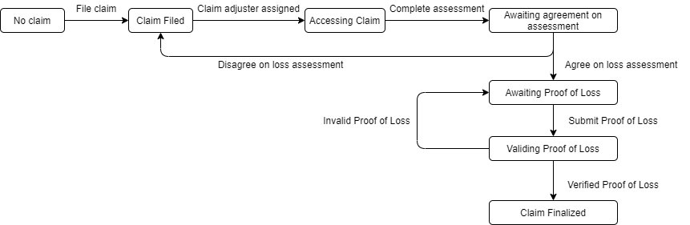

State Data
- states
- state
- name of applicant
- licence plate of applicant
- name of the other party involved
- licence plate of the other part involved
- claim adjuster
- proof of loss
- amount to be paid by applicant
- amount to be paid by the other party

Transitions
- fileClaim(claimNum, name, licencePlate, nameOther, licencePlateOther)
- assignClaimAdjuster(claimNum, claimAdjusterName)
- completeAssessment(claimNum, amountToPay, amountToPayOther)
- agreeOnAssessment(claimNum, agreement)
- submitProofOfLoss(claimNum, proofOfLoss)
- validProofOfLoss(claimNum, valid)

Functions
- checkStatus(claimNum)

Roles
- fileClaim(claimNum, name, licencePlate, nameOther, licencePlateOther) - user
- assignClaimAdjuster(claimNum, claimAdjusterName) - insurance company
- completeAssessment(claimNum, amountToPay, amountToPayOther) - claim adjuster
- agreeOnAssessment(claimNum, agreement) - user
- submitProofOfLoss(claimNum, proofOfLoss) - user
- validProofOfLoss(claimNum, valid) - insurance company/claim adjuster
- checkStatus(claimNum) user/insurance company/claim adjuster